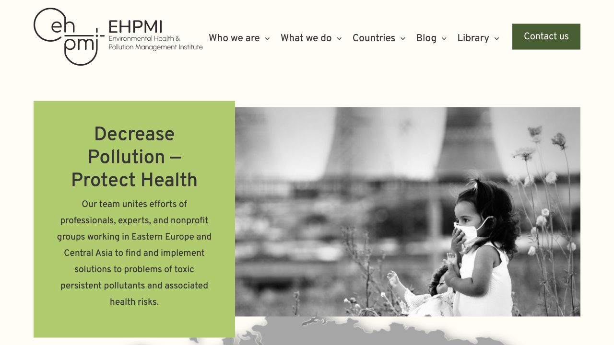
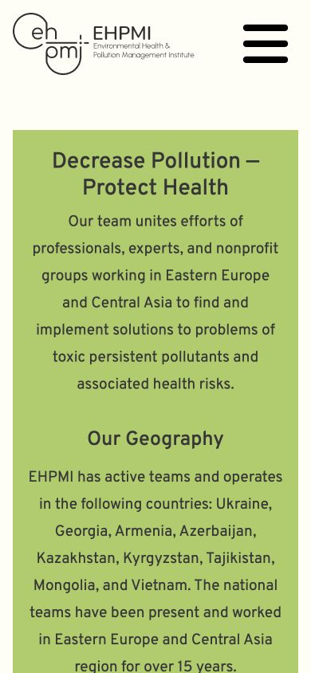

# EHPMI dev baseline QA — 2026-08-25

Status: `BASELINE CAPTURE PASS`

Recovery status: `QA-D NOT PASSED` until the mandatory isolated restoration rehearsal is completed.

## Source boundary

- Environment: `dev`.
- URL: `https://dev.ehpmi.org`.
- Document root: `/home2/nykvymmy/dev.ehpmi.org`.
- Database: `nykvymmy_ehpmidev`, distinct from production `nykvymmy_ehpmi`.
- Active theme: `ehpmi` version `1.2`.
- Production changes: none.

## Runtime baseline

- WordPress: `7.0.4`.
- Web PHP: `8.1.34`, confirmed through a temporary HTTP probe and removed immediately afterward.
- Shell PHP: `8.1.34`.
- WP-CLI PHP: `8.5.9`.
- WP-CLI: `2.9.0`.
- Database server: Percona Server `8.0.46-37`.
- Database tables: `53`.
- WordPress users: `2`.
- Newsletter subscribers: `172` total, `172` unique, `172` confirmed, `0` unsubscribed.

## Code verification

- All `46` theme files match the dev server SHA-256 list in `ops/theme-files.sha256`.
- All theme PHP files pass `php -l`.
- WordPress.org checksums pass for all `13` ordinary plugins.
- No credential values or private keys were found in the theme baseline.
- The canonical Markdown domain protocol in Git is version `v0.2.0`; the workspace copy is byte-identical.

## Visual baseline

Homepage title: `Environmental Health & Pollution Management Institute (EHPMI)`.

Desktop, 1280 × 720:

Mobile, 390 × 844:

The captures verify the current logo, desktop navigation, mobile menu affordance, hero typography, current slider image, and responsive text flow. Full-page capture exceeded the browser capture limit, so reproducible fixed viewports are the acceptance references.

## Drive backup readback

- Dev DB file ID: `1JHMUumOFjfWbbglg4GQ_egUTm42V0gN-`; size `376438` bytes.
- Site-content folder ID: `1DR-t5xCPPPY7sS-OmLWttjWcCta9OkZo`.
- Media transport: `52` unique numbered parts, no missing numbers and no duplicates.
- Aggregate media part size: `1348580659` bytes, exactly matching the verified logical archive.
- Full logical archive SHA-256: `c575a634fe9fb45c983e15a360df86f2685a1e139fd07c6e6e766728ba3453f6`.
- Root manifest file ID: `1JUKEJTql6mqCHByjUS5pz2R1e2vh-WuY`; size `3480` bytes.
- Parts manifest file ID: `1YaJKxxcVHBNTlOBSme_a9DhEgRJ40ERA`; size `17641` bytes.
- Parts checksum file ID: `133JH11TiEKMdRctmpl-rgwNPW7EOM75E`; size `6916` bytes.
- SHA256SUMS file ID: `1jn9qzSMbaFGoy0HfNxZSpLvemnb3Njhy`; size `7501` bytes.

The Drive connector has a per-file transfer limit, so the single verified `.tar.gz` is stored as byte-concatenated transport parts. `site-content-parts.yml` records the SHA-256 and Drive ID of every part. Concatenating them in lexical order reproduces the original archive and its full SHA-256.

## Known baseline debts

- `header.php` contains hardcoded `dev.ehpmi.org` structured-data and logo URLs.
- Frontend assets depend on Google Fonts, jsDelivr, cdnjs and Font Awesome Kit.
- Bootstrap `5.1.3` CSS is combined with Bootstrap `4.0.0` JavaScript and Popper `1.12.9`.
- `footer.php` does not call `wp_footer()`.
- `index.php` is empty because it incorrectly assumes a block theme, leaving classic fallback routes without output.
- ACF field groups are stored only in the database.
- Active slide assets are still under root `images/` and are therefore carried by the media archive rather than Git.

These findings describe the accepted pre-refactor state. They are not silently corrected in the baseline commit.
