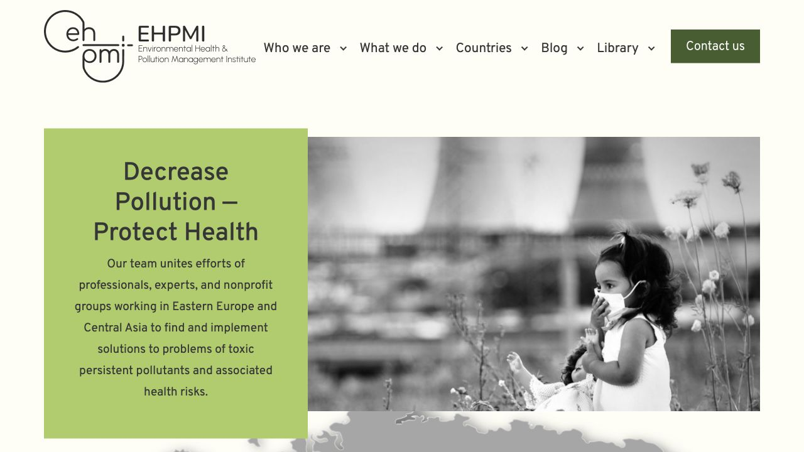

# EHPMI dev plugin-update QA — 2026-08-28

Status: `P1 DEV PASS`

Recovery status: `QA-D NOT PASSED`; rollback instructions are recorded, but an isolated restoration rehearsal was not performed in this stage.

## Boundary

- Environment changed: `dev` only.
- Dev URL: `https://dev.ehpmi.org`.
- Dev document root: `/home2/nykvymmy/dev.ehpmi.org`.
- Dev database: `nykvymmy_ehpmidev`.
- Production code and database changes: none.
- Newsletter sends and form submissions: none.
- WordPress core and the custom theme were not updated.
- Ordinary plugin code is installed from WordPress.org and is intentionally not stored in this repository; this release directory records versions, backup provenance, QA evidence, and recovery steps.

## Backup

- Pre-update `wp db check`: `PASS` for all `53` tables.
- Database backup: `2026-08-28_000713Z_ehpmi-dev-before-plugin-updates.sql.gz`.
- Size: `377577` bytes.
- SHA-256: `a427a59081d1aa816f357847f72d98ba584b078e86e64fbe93d1ba5ee55f1883`.
- Gzip integrity and `53` schema statements verified.
- Canonical copy: [Google Drive / database / dev](https://drive.google.com/file/d/15MW11SJcbuBAJdWW_cFTCEcXTu5LCsvv/view?usp=drivesdk).
- Drive metadata readback confirmed the exact filename, size, parent folder, and `application/gzip` type.
- Machine-readable evidence: [`backup.yml`](backup.yml).

## Plugin result

All `12` available updates completed successfully; every ordinary plugin remained active and no further plugin updates were reported.

| Plugin | Before | After |
| --- | ---: | ---: |
| Advanced Custom Fields | 6.7.0 | 6.8.8 |
| Akismet | 5.6 | 5.7.2 |
| Allow HTML in Category Descriptions | 1.2.4 | 1.2.5 |
| Contact Form 7 | 6.1.4 | 6.1.7 |
| YouTube Embed Plus | 14.2.5 | 14.2.6 |
| Force Regenerate Thumbnails | 2.2.2 | 2.3.0 |
| Newsletter | 9.1.1 | 9.3.5 |
| Real Media Library Lite | 4.22.62 | 4.23.0 |
| Contact Form 7 reCaptcha | 1.4.9 | 1.5.0 |
| Remove Category URL | 1.2.0 | 1.2.4 |
| WP-Optimize | 4.5.3 | 4.6.1 |
| WP Robots Txt | 1.3.5 | 1.3.6 |

Breadcrumb NavXT remained at `7.5.1`; hosting-specific must-use plugin `sso` remained at `0.5`. Exact states and auto-update settings are in [`plugin-versions.yml`](plugin-versions.yml).

## Server verification

- WordPress maintenance mode was disabled automatically after the update and confirmed inactive.
- WP-Optimize minify and page caches were purged through its public WP-CLI-accessible command; result: `caches cleared`.
- Post-update `wp db check`: `PASS` for all `53` tables.
- WordPress core checksums: `PASS`; only pre-existing extra files were reported (`wp-admin/error_log`, `wp-admin/includes/error_log`, three `wp-includes/**/error_log` files, and `wp-cli.yml`). No core checksum mismatch was reported.
- WordPress.org plugin checksums: `PASS (13/13)`.
- Runtime smoke checks: `4` ACF groups, `3` managed hero slides, `2` Contact Form 7 forms, and Newsletter loaded successfully.
- Recent logs contain WP-CLI PHAR PHP 8.1 deprecation notices in its bundled libraries. No plugin or site fatal error was found.

## Data preservation

The following before/after database counts are identical:

| Data | Before | After |
| --- | ---: | ---: |
| Newsletter subscribers (`wp_newsletter`) | 172 | 172 |
| Newsletter sent records (`wp_newsletter_sent`) | 0 | 0 |
| Newsletter email records (`wp_newsletter_emails`) | 0 | 0 |
| WordPress posts (`wp_posts`) | 693 | 693 |
| WordPress users (`wp_users`) | 2 | 2 |

No message was sent and no form was submitted during QA.

## Browser and HTTP QA

### Desktop — 1280 × 720

- Homepage title, header, footer, logo, map, three hero slides, two native carousels, Contact Form 7, and Newsletter form render as expected.
- Latest news contains `13` cards with `3` visible; partners contains `7` cards with `5` visible.
- Latest-news Next advances from items `1–3` to `2–4`.
- Desktop dropdown opens and reports `aria-expanded=true`.
- Browser error log is empty.

### Mobile — 390 × 844

- Latest news shows one item.
- Document horizontal overflow is `0` px.
- Contact and Newsletter forms remain within the viewport.
- Mobile menu opens, becomes visible, and reports `aria-expanded=true`.
- Browser error log is empty.

### Routes

- `/`: HTTP `200`.
- Nonexistent route: HTTP `404`, `Page not found`, footer present.
- `/robots.txt`: HTTP `200`.
- `/wp-login.php`: HTTP `200`.
- `/wp-json/`: HTTP `200`.
- `/wp-json/contact-form-7/v1`: HTTP `200`.

Homepage reference after the update:



## Recovery

Pre-stage repository point: `d8f0ba1d519c6eeedad3d46cca28fb62126fbf27`. This commit restores repository-managed operational files only; it does not contain ordinary plugin code.

1. Download the database backup from the Drive link above and verify it before use:

   ```sh
   shasum -a 256 2026-08-28_000713Z_ehpmi-dev-before-plugin-updates.sql.gz
   gzip -t 2026-08-28_000713Z_ehpmi-dev-before-plugin-updates.sql.gz
   ```

   The required SHA-256 is `a427a59081d1aa816f357847f72d98ba584b078e86e64fbe93d1ba5ee55f1883`.

2. Work only from `/home2/nykvymmy/dev.ehpmi.org`, confirm `wp option get siteurl` returns `https://dev.ehpmi.org`, and activate maintenance mode:

   ```sh
   cd /home2/nykvymmy/dev.ehpmi.org
   wp option get siteurl
   wp maintenance-mode activate
   ```

3. Restore the exact pre-update WordPress.org plugin versions:

   ```sh
   wp plugin install advanced-custom-fields --version=6.7.0 --force
   wp plugin install akismet --version=5.6 --force
   wp plugin install allow-html-in-category-descriptions --version=1.2.4 --force
   wp plugin install contact-form-7 --version=6.1.4 --force
   wp plugin install youtube-embed-plus --version=14.2.5 --force
   wp plugin install force-regenerate-thumbnails --version=2.2.2 --force
   wp plugin install newsletter --version=9.1.1 --force
   wp plugin install real-media-library-lite --version=4.22.62 --force
   wp plugin install wpcf7-recaptcha --version=1.4.9 --force
   wp plugin install remove-category-url --version=1.2.0 --force
   wp plugin install wp-optimize --version=4.5.3 --force
   wp plugin install wp-robots-txt --version=1.3.5 --force
   ```

   Breadcrumb NavXT `7.5.1` and must-use `sso` `0.5` are unchanged and do not require rollback.

4. Restore the matching pre-update database:

   ```sh
   gzip -cd 2026-08-28_000713Z_ehpmi-dev-before-plugin-updates.sql.gz | wp db import -
   ```

5. Purge WP-Optimize caches, deactivate maintenance mode, and verify the restored state:

   ```sh
   wp eval '$r=(new WP_Optimize_Minify_Commands())->purge_minify_cache(); echo is_wp_error($r) ? $r->get_error_message() : "caches cleared";'
   wp maintenance-mode deactivate
   wp plugin list --fields=name,status,version,update,auto_update
   wp db check
   wp core verify-checksums
   wp plugin verify-checksums --all --strict
   ```

6. Repeat the homepage desktop/mobile, form-rendering, carousel, menu, dropdown, `404`, and HTTP route checks recorded above. Compare subscriber/post/user counts with the pre-update values in this report.

The recovery sequence is documented but unexercised; a successful isolated restore and end-to-end verification are still required for `QA-D PASS`.
