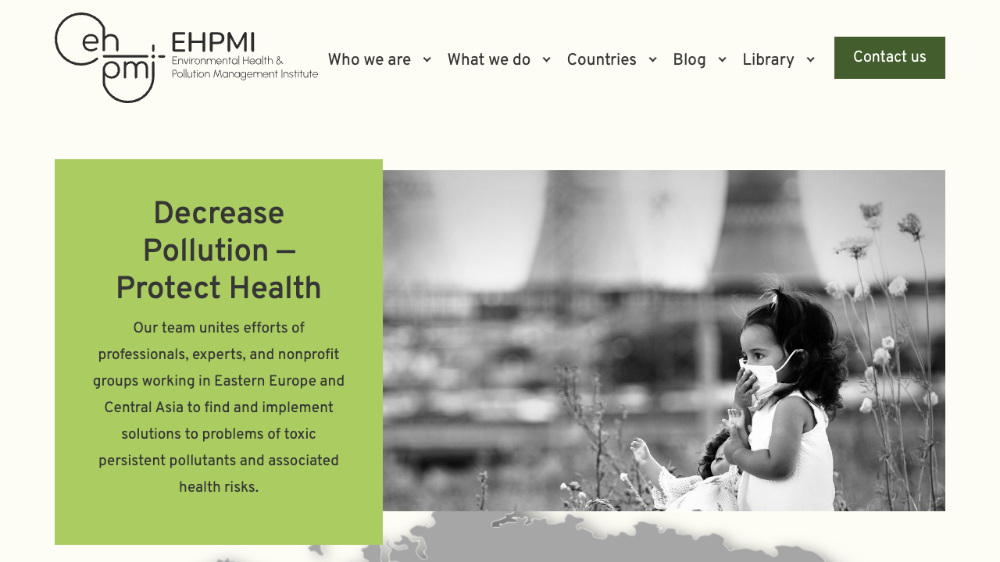
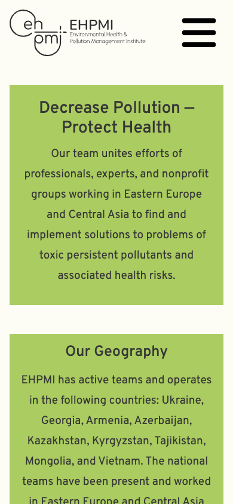

# EHPMI dev refactor QA — 2026-08-25

Status: `P0 DEV PASS`

Recovery status: `QA-D NOT PASSED`; no restoration rehearsal was performed in this stage.

## Boundary

- Environment changed: `dev` only.
- Dev document root: `/home2/nykvymmy/dev.ehpmi.org`.
- Dev database: `nykvymmy_ehpmidev`.
- Production code/database changes: none.
- Pre-change backup: `2026-08-25_013726Z_ehpmi-dev-baseline`.
- Newsletter sends: none.

## Implemented

- Restored WordPress lifecycle hooks: `wp_body_open()` and `wp_footer()`.
- Moved the accepted frontend assets to WordPress enqueue APIs while retaining their versions and SRI attributes.
- Reused WordPress core jQuery and wrapped the legacy script for no-conflict compatibility.
- Replaced hardcoded dev URLs with `home_url()` / theme file APIs and corrected Organization JSON-LD.
- Added a real PHP fallback for 404 and unspecified archive routes.
- Exported four ACF field groups with eight fields into `acf-json/`; ACF on dev reports all four local JSON files.
- Moved the three active hero source images into versioned theme assets with byte-identical SHA-256 values.
- Added a non-public `hero_slide` admin content type. The current homepage keeps the exact three theme assets as a deterministic fallback until operator-managed slide entries are populated.
- Replaced the desktop menu chevron glyph with CSS geometry so it no longer depends on a font glyph.

## Verification

- All theme PHP files in the changed surface pass syntax checks locally; the deployed changed PHP files pass server-side syntax checks.
- Dev homepage returns HTTP `200`.
- Active hero source is `wp-content/themes/ehpmi/assets/images/hero/slide1.jpeg`.
- Latest-news Owl Carousel initializes with `owl-loaded`.
- Mobile navigation opens after Bootstrap is ready.
- Browser page-error list is empty in the final homepage and mobile-menu checks.
- A nonexistent route returns HTTP `404`, renders `Page not found`, includes the footer, and has no browser page errors.
- The final theme contains `53` files. Server/local SHA-256 comparison found one stale `header.php`, which was force-synchronized by checksum and then matched; the other `52` files already matched.
- Misplaced transport duplicates created during deployment were removed by exact name after the correct copies were verified.

## Visual references

Desktop, 1280 × 720:

Mobile, 390 × 844:

The accepted layout, logo, hero copy, hero image, desktop navigation, contact button, and mobile header remain visually consistent with the baseline.

## Deferred after this stopping point

- Populate the three current fallback images as operator-managed `hero_slide` entries if one-by-one editing of the existing slides is required immediately.
- Align Bootstrap CSS/JavaScript versions and then remove remaining jQuery dependencies in a separate visual-QA stage.
- Continue template escaping/semantic cleanup and post-type label cleanup.
- Update plugins only in a separate commit with before/after dev QA.
- Run the isolated recovery rehearsal required for `QA-D PASS` before protocol `v1.0.0`.
