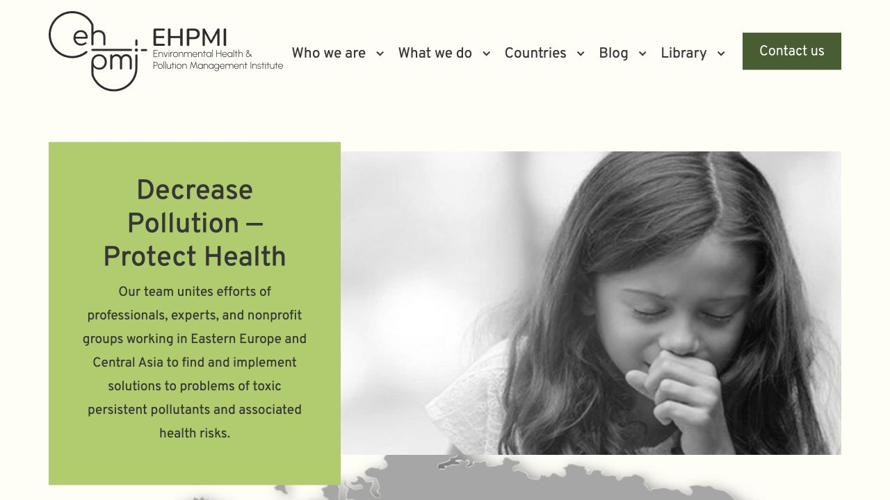

# EHPMI dev historical-asset cleanup QA — 2026-08-27

Status: `P1 DEV PASS`

Recovery status: `QA-D NOT PASSED`; no isolated restoration rehearsal was performed in this stage.

## Boundary

- Environment changed: `dev` only.
- Dev document root: `/home2/nykvymmy/dev.ehpmi.org`.
- Dev database: `nykvymmy_ehpmidev`.
- Database writes: none.
- Production code/database changes: none.
- Newsletter sends: none.

## Archive and removal

- Archived `13` unreferenced historical theme assets before deletion.
- Uncompressed source size: `5919438` bytes.
- Archive: `2026-08-27_070900Z_ehpmi-unused-theme-assets.tar.gz`.
- Archive size: `5480868` bytes.
- Archive SHA-256: `cb6d8a2adaf00d70167def255c01afa5cdfe90b1ae6e7c195774b00ffbc32d6d`.
- Archive MD5: `aa9472135665af9a363d906bf716a8b0`.
- Google Drive file ID: `19RWT50jja9Myg93_Is8-g7slM1mcHaM0`.
- Google Drive URL: `https://drive.google.com/file/d/19RWT50jja9Myg93_Is8-g7slM1mcHaM0/view?usp=drivesdk`.
- Drive metadata readback reported the exact local archive size.
- Gzip integrity passed; extracted files compare byte-for-byte with all `13` sources.
- The archive stores each file at its original WordPress-root-relative path and includes `ARCHIVE_MANIFEST.yml`.
- The complete per-file inventory and checksums are recorded in `archived-assets.yml`.

## Non-use evidence

- Theme-source search found no active references to the `13` candidates.
- WordPress database search across all dev tables found no matching paths or basenames.
- Rendered `src` and `href` attributes on the homepage and 404 page contain no archived file names.
- The deleted `images/style.css` referred only to the deleted historical `images/marker.png`; neither file was enqueued by the theme.
- The active counterparts were retained: `images/logo.svg`, `images/map9-01.webp`, and `images/marker.svg`.

## Verification

- All remaining theme PHP files pass local syntax checks.
- Active `onload.js` passes JavaScript syntax validation.
- `git diff --check` passes.
- Homepage returns HTTP `200`.
- A nonexistent route returns HTTP `404`, renders `Page not found`, and includes the footer.
- Desktop dropdown opens and dismisses normally.
- Hero carousel contains the three managed Media Library slides.
- Latest-news OwlCarousel reports `owl-loaded`.
- Mobile navigation opens at 390 × 844, displays the menu, and changes `aria-expanded` to `true`.
- The active logo and map load from `logo.svg` and `map9-01.webp`; the map marker computed style loads `marker.svg`.
- Homepage and 404 browser error logs contain no errors.
- The final theme contains `37` files. Local and dev SHA-256 lists match completely; `theme-files.sha256` records the accepted set.

## Visual reference

Desktop, 1280 × 720:

The accepted logo, navigation, hero copy, managed slide, contact button, spacing, and color treatment remain visually consistent with the previous accepted refactor stage.

## Recovery

- Restore the removed Git paths from pre-cleanup commit `418123313a12dac5379e30cabda6551eda4ff00e` if code-history recovery is preferred.
- For migration-style recovery, download the Drive archive, verify its SHA-256, and extract it at the WordPress document root; the original paths are preserved.

## Deferred after this stage

- Replace OwlCarousel and remaining jQuery-dependent effects in a separate visual-QA stage.
- Update plugins only in a separate commit with before/after dev QA.
- Run the isolated recovery rehearsal required for `QA-D PASS` before protocol `v1.0.0`.
