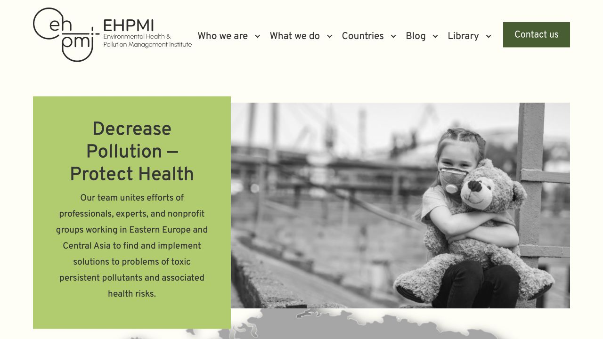

# EHPMI dev legacy-artifact cleanup QA — 2026-08-27

Status: `P1 DEV PASS`

Recovery status: `QA-D NOT PASSED`; no isolated restoration rehearsal was performed in this stage.

## Boundary

- Environment changed: `dev` only.
- Dev document root: `/home2/nykvymmy/dev.ehpmi.org`.
- Dev database: `nykvymmy_ehpmidev`.
- Database writes: none.
- Production code/database changes: none.
- Newsletter sends: none.

## Removed legacy artifacts

- `wp-content/themes/ehpmi/classes/class-menu-dropdown.bkp` — obsolete pre-`Walker_Nav_Menu` PHP backup; SHA-256 `1797d70745cfe69abe2cb4fe5fd4eac80a4d3fb74592201a1b8ccc25338e9a15`.
- `wp-content/themes/ehpmi/onload.js.min` — stale minified copy that predates the accepted Bootstrap 5 source; SHA-256 `d0e3b83373a9c68aa8fffa97bec0e57bf9800a0241864706379b22e0c4d3094a`.
- `wp-content/themes/ehpmi/images/marker-bkp-202404.png` — historical backup marker; SHA-256 `3fe5ac24259505acdabc29685e5003aad3314d06dc90f969e95152262c0b2a88`.

The three server files matched their Git copies before deletion. They remain recoverable from commit `f6b2b3c`.

## Non-use evidence

- Theme-source search found no references to any of the three file names.
- WordPress database search across all tables with the active prefix found no matches for any file name.
- The active theme enqueues `onload.js`, includes `classes/class-menu-dropdown.php`, and uses `images/marker.svg`; it does not load the deleted variants.
- Browser inspection of rendered `src` and `href` attributes on the homepage and 404 page found no deleted file names.
- Other unclassified historical images and styles were intentionally retained for a separate asset-inventory stage.

## Verification

- All remaining theme PHP files pass local syntax checks.
- Active `onload.js` passes JavaScript syntax validation.
- Homepage returns HTTP `200`.
- A nonexistent route returns HTTP `404`, renders `Page not found`, and includes the footer.
- Desktop dropdown opens and closes.
- Hero carousel contains three managed slides and advances normally.
- Latest-news OwlCarousel reports `owl-loaded`.
- Mobile navigation opens at 390 × 844 and updates `aria-expanded`.
- Homepage and 404 browser error logs are empty.
- The final theme contains `50` files. Local and dev SHA-256 lists match completely.

## Visual reference

Desktop, 1280 × 720:

The accepted logo, navigation, hero copy, managed slides, contact button, spacing, and color treatment remain visually consistent with the previous accepted refactor stage.

## Deferred after this stage

- Inventory the remaining unreferenced image/style candidates before deciding whether they belong in Git, Drive media history, or neither.
- Replace OwlCarousel and remaining jQuery-dependent effects in a separate visual-QA stage.
- Update plugins only in a separate commit with before/after dev QA.
- Run the isolated recovery rehearsal required for `QA-D PASS` before protocol `v1.0.0`.
