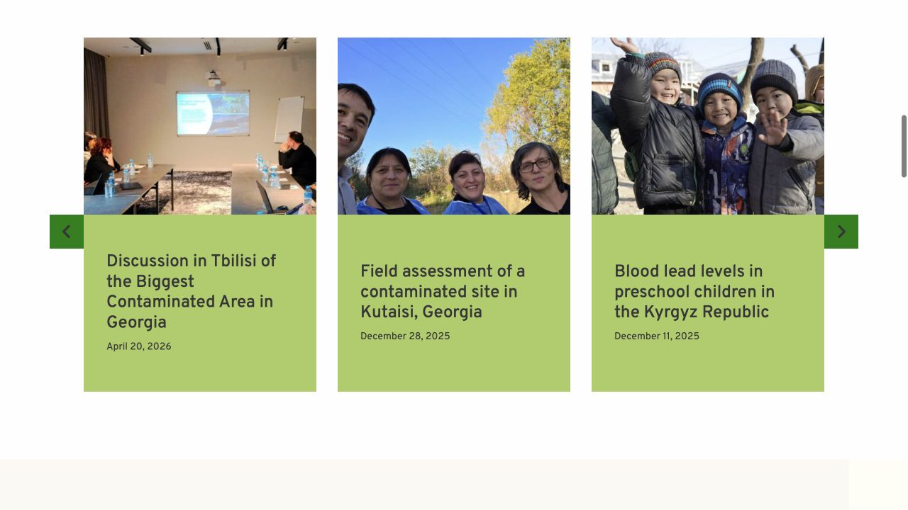
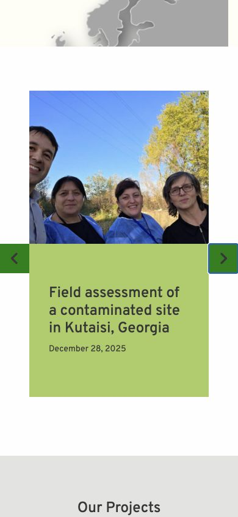

# EHPMI dev native-carousel QA — 2026-08-28

Status: `P1 DEV PASS`

Recovery status: `QA-D NOT PASSED`; no isolated restoration rehearsal was performed in this stage.

## Boundary

- Environment changed: `dev` only.
- Dev URL: `https://dev.ehpmi.org`.
- Dev document root: `/home2/nykvymmy/dev.ehpmi.org`.
- Dev database: `nykvymmy_ehpmidev`.
- Content, schema, user, and Newsletter data writes: none.
- WP-Optimize updated its dev cache timestamp while purging stale minified assets; no editorial data was changed.
- Production code/database changes: none.
- Newsletter sends: none.

## Implementation

- Replaced the three OwlCarousel initializations with one native, reusable carousel controller.
- Native carousels use browser scroll snapping and retain touch/swipe scrolling.
- Added previous/next buttons, ArrowLeft/ArrowRight keyboard control, disabled boundary state for the non-looping news carousel, looping button navigation for partners/testimonials, live position text, `aria-hidden`, and `inert` state for off-screen items.
- Preserved the accepted responsive counts:
  - latest news: `1` item below 600 px, `3` items from 600 px;
  - testimonials: `1` item below 721 px, `2` items from 721 px, `3` items from 1025 px;
  - partners: `1` item below 600 px, `3` items from 600 px, `5` items from 1000 px.
- Replaced jQuery scroll/parallax handlers with requestAnimationFrame-throttled DOM handlers.
- Replaced viewport animation polling with `IntersectionObserver`.
- Retained the future search toggle with native Web Animations and keyboard handling.
- Preserved map-point closing and Bootstrap hero/dropdown behavior with native events and Bootstrap 5 APIs.
- Removed OwlCarousel CSS/JS, animate.css, and the theme's jQuery dependency from WordPress enqueue configuration.
- Updated both `css/style.less` and the deployed `css/style.css`.

## Cache handling

- The first browser pass received the old WP-Optimize minified CSS while the new JavaScript was already live.
- Purged minify/page cache through the installed plugin's public `WP_Optimize_Minify_Commands::purge_minify_cache()` method under WP-CLI.
- Result: `caches cleared`.
- The rebuilt asset set uses cache stamp `1787873371` and contains the native carousel styles.

## Verification

- All theme PHP files pass syntax checks.
- `onload.js` passes `node --check`.
- `git diff --check` passes.
- Theme-source search finds no OwlCarousel, jQuery, or animate.css runtime references.
- Rendered homepage loads no jQuery, OwlCarousel, or animate.css assets and contains no Owl markup.
- Homepage returns HTTP `200`.
- A nonexistent route returns HTTP `404`, renders `Page not found`, and includes the footer.
- Hero retains its three managed Media Library slides.
- Desktop dropdown opens to visible opacity `1`, closes to hidden opacity `0`, and updates `aria-expanded`.
- Scroll parallax updates after page scrolling, and in-view sections receive the expected class.
- Homepage and 404 browser error logs are empty.
- The final theme contains `37` files. Local and dev SHA-256 manifests match completely.

## Carousel behavior

### Desktop — 1280 × 720

- Latest news: `13` items, `3` visible, 30 px gap, 328 px item width inside a 1044 px viewport.
- Next button changes the visible range from items `1–3` to `2–4`.
- ArrowRight changes the visible range to `3–5` and leaves focus on the carousel viewport.
- Partners: `7` items, `5` visible, 10 px gap; Previous from the initial position wraps to items `3–7`.
- Dev currently has `0` published testimonials, so that conditional section is not rendered. Its `1/2/3` responsive configuration uses the same controller verified by the news and partner instances.

### Mobile — 390 × 844

- Latest-news and partner carousels show one 294 px item in a 294 px viewport.
- Next advances exactly one item.
- Document horizontal overflow is `0` px.
- Mobile navigation opens, displays the menu, and changes `aria-expanded` to `true`.

## Visual references

Homepage, desktop 1280 × 720:

Latest news, desktop 1280 × 720:

Latest news, mobile 390 × 844:

The accepted logo, navigation, hero, card treatment, spacing, colors, and carousel arrow placement remain visually consistent with the previous accepted stage.

## Recovery

- Pre-stage Git point: `f22ab236f0bb40b44f6f913051fe3d8a2f401236`.
- Implementation commit: `5b7268c`.
- Roll back the seven changed theme files from the pre-stage commit and purge the dev WP-Optimize cache again.

## Deferred after this stage

- Plugin updates remain a separate stage with independent before/after QA.
- Run the isolated recovery rehearsal required for `QA-D PASS` before protocol `v1.0.0`.
